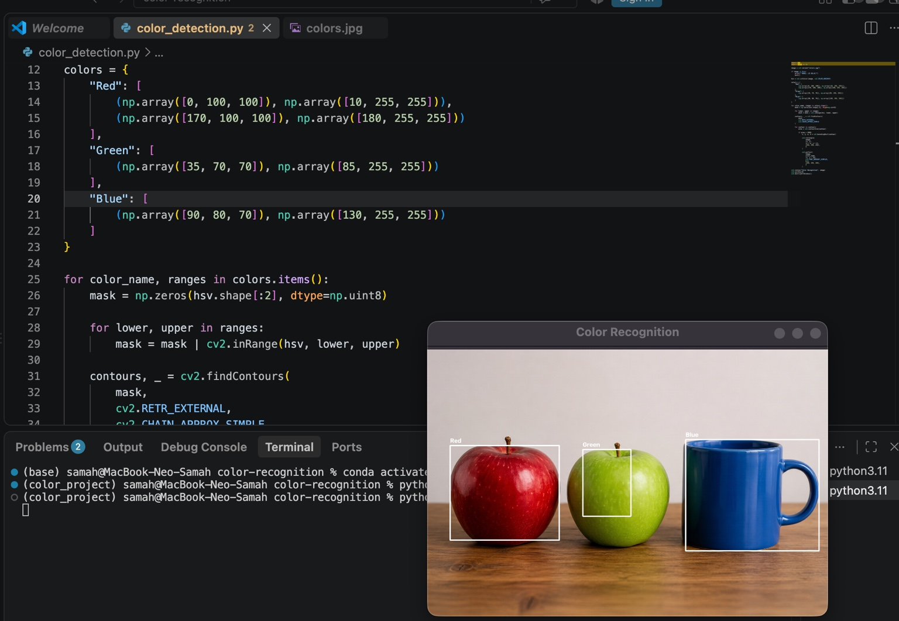

# 🎨 Color Recognition Using OpenCV


A computer vision project that detects and identifies **red, green, and blue objects** in an image using Python and OpenCV.

The program analyzes the image, isolates each color using the HSV color space, detects object boundaries, and displays the color name with a bounding box around each detected object.

---

## 📸 Project Result



The program successfully recognizes:

- 🔴 Red apple
- 🟢 Green apple
- 🔵 Blue cup

---

## 📌 Project Overview

This project demonstrates a simple and effective method for color recognition using image processing techniques.

Instead of using a trained artificial intelligence model, the project detects colors by converting the image from the **BGR color space** to the **HSV color space**.

HSV makes color detection more reliable because it separates the color value from brightness and saturation.

---

## ✨ Features

- Detects red, green, and blue objects.
- Draws a bounding box around every detected object.
- Displays the detected color name.
- Removes small unwanted detections using contour-area filtering.
- Works with a saved image without requiring a camera.
- Uses a clear and beginner-friendly Python implementation.

---

## 🧠 How the Program Works

The program follows these steps:

1. Loads the input image using OpenCV.
2. Converts the image from BGR to HSV.
3. Defines HSV ranges for red, green, and blue.
4. Creates a binary mask for each color.
5. Finds the contours of detected colored objects.
6. Ignores small contours to reduce noise.
7. Draws a rectangle around each valid object.
8. Writes the detected color name above the object.
9. Displays the final processed image.

---

## 🛠️ Technologies Used

| Technology | Purpose |
|---|---|
| Python 3.11 | Main programming language |
| OpenCV | Image processing and object detection |
| NumPy | Creating arrays and color masks |
| Anaconda | Managing the virtual environment |
| Visual Studio Code | Writing and running the project |
| GitHub | Project hosting and documentation |

---

## 📂 Project Structure

```text
color-recognition-opencv/
│
├── color_detection.py   # Main Python program
├── colors.jpg           # Input image
├── result.png           # Final project result
└── README.md            # Project documentation
```

---

## ⚙️ Installation

### 1. Create an Anaconda environment

```bash
conda create -n color_project python=3.11 -y
```

### 2. Activate the environment

```bash
conda activate color_project
```

### 3. Install the required libraries

```bash
pip install opencv-python numpy
```

---

## ▶️ How to Run the Project

Open the project folder in Visual Studio Code.

Activate the environment:

```bash
conda activate color_project
```

Run the program:

```bash
python color_detection.py
```

The processed image will appear in a new window.

Press any keyboard key while the result window is active to close it.

---

## 🎯 HSV Color Ranges

The following HSV ranges are used in this project:

| Color | Lower HSV | Upper HSV |
|---|---:|---:|
| Red — Range 1 | `[0, 100, 100]` | `[10, 255, 255]` |
| Red — Range 2 | `[170, 100, 100]` | `[180, 255, 255]` |
| Green | `[35, 70, 70]` | `[85, 255, 255]` |
| Blue | `[90, 80, 70]` | `[130, 255, 255]` |

Red uses two ranges because the red hue is located at both ends of the OpenCV HSV hue scale.

---

## 🔍 Noise Reduction

Small colored regions and light reflections may create unwanted detections.

To reduce this problem, the program checks the area of every detected contour:

```python
if area > 5000:
```

Only objects with an area larger than `5000` pixels are displayed. This produces cleaner and more accurate results.

---

## 📚 What I Learned

Through this project, I learned how to:

- Create and activate an Anaconda virtual environment.
- Install and use OpenCV and NumPy.
- Read and process images with Python.
- Convert images between color spaces.
- Create masks using HSV color ranges.
- Detect contours and calculate their areas.
- Draw rectangles and text on images.
- Organize and document a programming project.
- Upload project files and documentation to GitHub.

---

## 🚀 Future Improvements

Possible future improvements include:

- Detecting additional colors.
- Allowing the user to select an image.
- Adding real-time color recognition using a camera.
- Displaying the detected object's coordinates and area.
- Creating a graphical user interface.
- Saving the processed result automatically.

---

## ✅ Conclusion

This project provides a practical introduction to computer vision and image processing using OpenCV.

It successfully recognizes red, green, and blue objects, filters small unwanted detections, and displays clear bounding boxes and labels around the detected objects.

---

### Developed as an OpenCV Color Recognition Project
